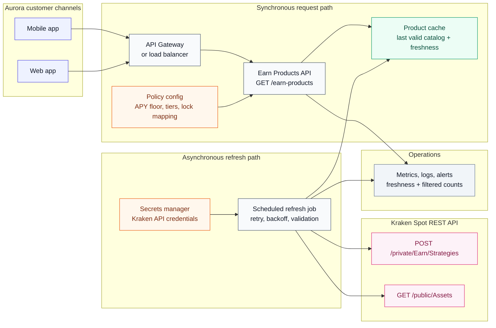

# Solution Design Note: Aurora Bank Kraken Earn PoC

## Purpose

Aurora Bank wants to offer a curated crypto-yield catalog through Kraken Earn. This PoC implements the integration boundary Aurora's frontend would consume: `GET /earn-products?tier={standard|premium|private}`. It also includes a small demo UI at `/` for reviewing the same tier-filtered catalog.

The implementation is intentionally local and deterministic for the assessment environment. It reads Kraken-shaped fixture files from `./data`, validates them, applies Aurora's policy, and returns either a sorted product array or a structured error. It does not call Kraken or the internet at runtime.

## Current PoC Flow

This is the runtime path used by the submitted Docker service. All inputs come from the mounted `./data` directory; there are no outbound network calls at runtime.

```mermaid
flowchart LR
  classDef request fill:#eef2ff,stroke:#4f46e5,color:#111827
  classDef process fill:#f8fafc,stroke:#94a3b8,color:#111827
  classDef data fill:#ecfdf5,stroke:#059669,color:#064e3b
  classDef error fill:#fef2f2,stroke:#dc2626,color:#7f1d1d
  classDef response fill:#f5f3ff,stroke:#7c3aed,color:#111827

  Client["Aurora caller<br/>or demo UI"]:::request --> Route["GET /earn-products<br/>tier query"]:::request

  subgraph Service["Next.js service boundary"]
    Route --> TierCheck["Validate tier<br/>standard | premium | private"]:::process
    TierCheck -->|valid| Loader["Read ./data/*.json<br/>sorted file order"]:::data
    TierCheck -->|invalid| InvalidTier["400 INVALID_TIER"]:::error

    Loader --> Shape["Classify response shape"]:::process
    Shape --> Strategies["Earn strategies<br/>result.items[]"]:::data
    Shape --> Assets["Asset metadata<br/>result asset map"]:::data

    Strategies --> Validate["Zod schema validation"]:::process
    Assets --> Validate
    Validate -->|malformed or missing source| DataUnavailable["500 DATA_UNAVAILABLE"]:::error

    Validate --> Merge["Deterministic merge<br/>later files win"]:::process
    Merge --> Transform["Transform to Aurora product contract"]:::process
    Transform --> Policy["Apply APY floor,<br/>lock type, and tier policy"]:::process
    Policy --> Symbols["Normalize asset symbols<br/>altname fallback"]:::process
    Symbols --> Sort["Sort by APY desc,<br/>asset, strategy ID"]:::process
  end

  Sort --> Success["JSON array response"]:::response
```

## Kraken Data Sources

| Kraken source | Purpose in this PoC |
|---|---|
| `POST /private/Earn/Strategies` | Primary catalog source for strategy ID, asset code, `lock_type`, `apr_estimate`, and `user_min_allocation`. |
| `GET /public/Assets` | Asset metadata source used to map Kraken asset codes to frontend-facing symbols with `altname`, for example `XETH -> ETH`. |

The loader reads every `.json` file in `./data`, not only `assets.json` and `strategies.json`. Additional grader or QA fixture files can be added without code changes.

## Product Eligibility

Aurora tier policy:

| Tier | Included lock types | Reasoning |
|---|---|---|
| Standard | `instant` | Assessment explicitly maps Standard flexible/instant access to `lock_type.type === "instant"`. |
| Premium | `instant`, `bonded` | Premium may see bonded strategies with unbonding periods. |
| Private | `instant`, `bonded` | Same product access as Premium for v1. |

Returned `eligibleTiers` is product-level:

- `instant`: `["Standard", "Premium", "Private"]`
- `bonded`: `["Premium", "Private"]`

Unsupported or ambiguous lock types (`flex`, `timed`, `hybrid`, unknown values) are excluded for v1. That is safer than inferring a customer-facing taxonomy from mock data. Aurora and Kraken should confirm how those lock types should map before exposing them.

`can_allocate` is not used as the Aurora tier filter. It appears to be an upstream Kraken account-level availability signal, while this PoC models Aurora's own tier policy. In production, both signals should be reconciled before products reach customers.

## APY Policy

The mock field is `apr_estimate.low/high`, while Aurora's output field is `apyValue`. This PoC maps `apr_estimate.low` to `apyValue` for eligibility and sorting because Aurora's `>= 3.00%` rule is a hard compliance threshold. Using the lower bound is conservative and avoids approving products based on the optimistic side of a range.

Display rules:

- Equal low/high: `3.00%`
- Differing low/high: `8.00%-12.00%`
- Sort: `apyValue` descending, then asset symbol, then strategy ID

Precision handling: decimal strings like `2.9999999999999999` are treated as below threshold even if JavaScript would round the parsed number to `3`. Missing, blank, or malformed APR values are skipped instead of causing a request failure.

## Error Contract

The API never returns raw exceptions or stack traces.

| Condition | Status | Body |
|---|---:|---|
| Missing or invalid `tier` | 400 | `{ "error": { "code": "INVALID_TIER", "message": "tier must be one of: standard, premium, private." } }` |
| Missing data directory, unreadable JSON, malformed response, unrecognized response shape, or missing required source category | 500 | `{ "error": { "code": "DATA_UNAVAILABLE", "message": "Earn product data is currently unavailable." } }` |

The demo UI uses the same product-building logic as the API and renders matching empty/error states.

## Production Reference Architecture

This is the recommended production shape after the PoC graduates from local fixtures to authenticated Kraken API access. The important design choice is to keep product refresh out of the customer request path and serve the last valid, policy-filtered catalog from an internal cache.

Production implementation notes:

- Keep the product transformation layer as a stable contract boundary between Kraken schemas and Aurora frontend schemas.
- Fetch Kraken data out of band with retry/backoff, cache the last valid product set, and expose freshness metadata internally.
- Store Kraken credentials in a managed secrets service and never require credentials in frontend clients.
- Track operational metrics: refresh success/failure, data age, filtered counts by reason, per-tier product counts, request latency, and structured 4xx/5xx counts.
- Add contract tests using saved Kraken fixtures before moving from mock data to live authenticated calls.

## Edge Cases Covered

- Reads all JSON files in `./data`.
- Merges duplicate assets/strategies deterministically by sorted filename order.
- Uses `altname` for display and falls back to raw asset code if metadata is missing.
- Excludes unsupported lock types rather than guessing.
- Skips missing or malformed APR values.
- Handles APY precision just below `3.00%`.
- Uses only the default Docker Compose network.

## Recommended Next Steps

1. Confirm final APR/APY terminology and whether Aurora wants lower-bound, midpoint, or a separate effective APY from Kraken.
2. Reconcile Aurora customer tiers with Kraken `can_allocate` and `allocation_restriction_info`.
3. Decide product taxonomy for `flex`, `timed`, `hybrid`, and future Kraken lock types.
4. Add authenticated Kraken client code behind the existing validation and transformation boundary.
5. Add production observability, freshness monitoring, and an operational runbook for stale or unavailable upstream data.
